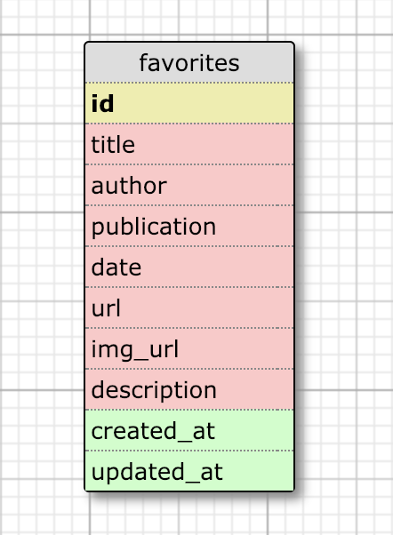

# *News to Me* - ReadMe

### Introduction:

*News to Me* is a news app designed to allow a user to access top headlines about **TOPIC**. *News to Me* consumes data from the NewsAPI.org API. It was developed using Ruby 2.4.1 and Rails 5.2.2, and uses a PostgreSQL 11.1 database. The production app can be found at https://newstome.herokuapp.com/.

### Setup:

To begin, clone this repo:

```
git@github.com:DanHutch/News_to_Me.git
```
After you `cd` into the project directory, run `bundle` from the command line.
Next, run `bundle exec rake db:{create,migrate}` to create the database and schema.

At this point, you should be able to run the local test suite using `bundle exec rspec`.
The local test suite uses `gem 'vcr'` to record HTTP/API responses. Once you have configured and properly hidden the NewsAPI.org API key (see below), delete the contents of the spec/casettes folder and re-run the test suite to verify API

*This app uses `gem 'news-api'` to get data from the NewsAPI.org API. It requires an API key for the NewsAPI.org API, in order to function. In the development of News to Me, `gem 'figaro'` was used to hide secrets, such as this API key, in testing and development, and is recommended for this purpose.*


### Gems:

- rails
- pg
- puma
- sass-rails
- uglifier
- coffee-rails
- jbuilder
- bootsnap
- figaro
- faraday
- news-api
- travis
- byebug
- rspec-rails
- capybara
- launchy
- pry
- shoulda-matchers
- fuubar
- simplecov
- webmock
- vcr
- database_cleaner
- web-console
- listen
- tzinfo-data

### Schema:



### Future Iterations:

-

### Contributing:

In order to contribute, please fork this repo, then clone your new repo and create a branch for your feature.

Please make sure to test your feature fully, using RSpec, before commiting your changes and pushing to your own repo, then create and submit a pull request back to this repository.

Please contact Dan Hutchinson (Github: DanHutch) if you have any questions, etc. Thank you!